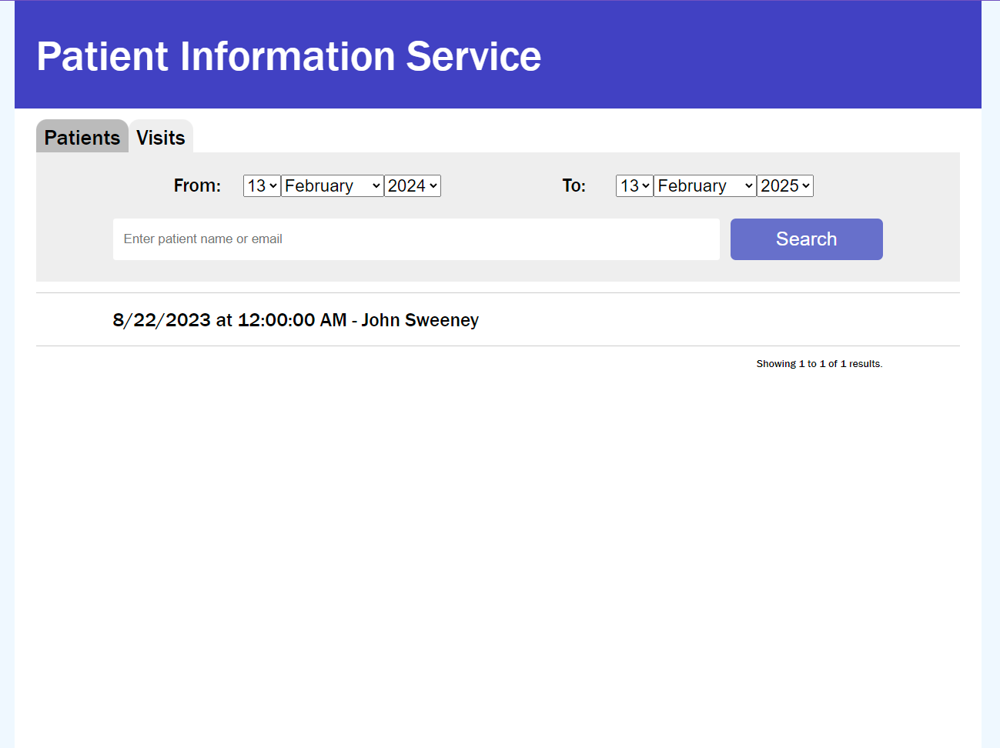

# Health Care Informed Engineering - Take home assessment

  

We are a very practical team at Health Care Informed and this extends to the way that we work with you to find out if this team is a great fit for you. We want you to come away with a great understanding of the work that we actually do day to day and what it is like to work with us. 

So instead of coding at a whiteboard with someone watching over your shoulder under high pressure, which is not a thing we often do, we instead discuss code that you have written previously when we meet face to face.

The Brief:

“A Health Care Informed customer needs to be able to_ **_find patient visit information_** _at one of their hospitals. Create a simple web application using React, Typescript, C# that allows a customer to_ **_search_** _patient/hospital visit information and display results. The application should have a very simple styled UX, some simple API’s and leverages the data store and sample data provided”._

## Deployment Instructions

### Pre-requisites

* Docker installed locally

### Steps

1. Clone this repo to your local machine
2. In the terminal, navigate to the repo root directory (where this README lives)
3. Run `docker build -t com_evanjdooner_hci .` to build the docker image
4. Run `docker run -d -p 8080:80 com_evanjdooner_hci com_evanjdooner_hci_run` to start the server
5. In your browser, navigate to http://localhost:8080 to access the app